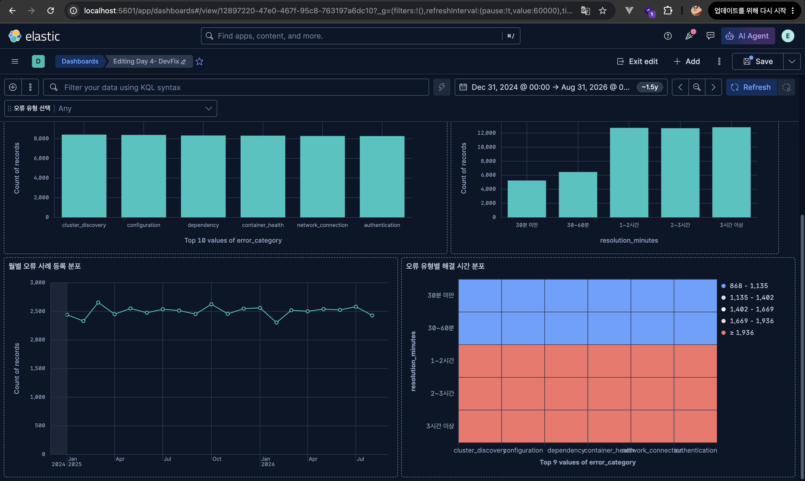
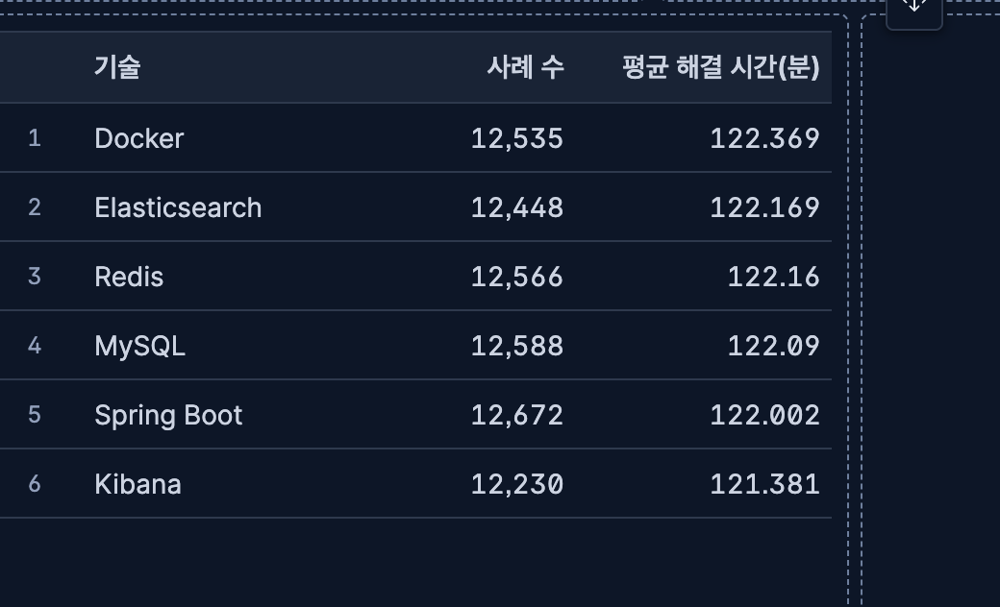

# Day 4 개인 Dashboard 설계

## 1. 사용자와 목적

- 내 주제: DevFix 개발 오류 해결 사례 분석
- 이 Dashboard를 볼 사람: 개발 중 오류 해결 사례를 찾고 현황을 파악하려는 개발자
- Dashboard를 보고 결정하거나 행동할 것: 오류 유형·기술·검증 여부·해결 시간 분포를 확인하고 우선 검토할 사례를 정한다.
- 사용할 index / Data View: `devfix-cases` / `DevFix Dashboard`

## 2. 데이터 준비 경로

- [x] A: 개인 데이터로 제작
- [ ] B: 공통 products로 제작하며 개인 데이터 보강 규칙 작성
- [ ] C: 공통 Dashboard를 완성하고 개인 청사진에 집중

선택 이유: `devfix-cases`에 50,000건이 적재되어 있고 분류·boolean·숫자·날짜 field가 모두 있어 개인 Dashboard를 제작할 수 있다.

## 3. 질문-데이터-차트 청사진

| 번호 | 분석 질문 | 필요한 field | 현재 존재? | mapping type | 계산·그룹 방식 | 차트 | filter/control | 확인 기준 |
|---|---|---|---|---|---|---|---|---|
| Q1 전체 규모 | 전체 오류 사례는 몇 건인가? | Records | 예 | 문서 수 | Count | Metric | `error_category` Control | 전체 50,000건 |
| Q2 그룹 비교 | 어떤 오류 유형과 기술의 사례가 많은가? | `error_category`, `technology` | 예 | `keyword` | Top values + Count | Bar, Table | `error_category` Control | 오류 유형 6개, 기술 6개 |
| Q3 분포/정확한 값 | 해결 시간은 어느 구간에 몰려 있고 기술별 평균은 어떤가? | `resolution_minutes`, `technology` | 예 | `integer`, `keyword` | Custom ranges + Count, Average | Bar, Table, Heat map | `error_category` Control | 최소 5분, 최대 240분, 평균 약 122분 |
| Q4 상태/시간 | 검증된 사례 비율과 월별 등록 분포는 어떤가? | `verified`, `created_at` | 예 | `boolean`, `date` | Top values + Count, Date histogram | Donut, Line | `error_category` Control | true 37,596건, false 12,404건 |

## 4. 데이터 부족 분석

- 현재 데이터로 답할 수 없는 질문: 실제 장애의 심각도와 SLA 준수 여부, 담당자별 성과를 판단할 수 없다.
- 부족한 field: `severity`, `service`, `resolved_at`, `sla_met`, `assignee_team`
- 필요한 mapping type: `keyword`, `date`, `boolean`
- 필요한 값의 범위·범주·비율: 심각도 P1~P4, 서비스명, 실제 해결 시각, SLA 충족 여부
- 날짜가 필요하다면 기간과 단위: 최소 1년, 월·주·일 단위
- 한 문서가 의미할 사건 또는 대상: 개발 오류 해결 사례 1건
- 생성 또는 수집 방법: 비식별 운영 로그와 티켓에서 필요 field를 추출하거나 합성 규칙으로 추가한다.
- 데이터 수가 충분하다고 판단할 기준: 각 심각도·서비스 그룹에 비교 가능한 문서가 있고 최소 3개월 이상의 날짜 분포가 있는 상태

## 5. 제작 순서

1. `DevFix Dashboard` Data View와 전체 50,000건을 확인한다.
2. Metric, 오류 유형 Bar, 기술별 Table, 검증 여부 Donut을 만든다.
3. 해결 시간 Bar, 월별 Line, 오류 유형×해결 시간 Heat map을 추가한다.
4. `error_category` Options list를 적용하고 Elasticsearch 집계와 결과를 교차 검증한다.

## 6. 완료 예상 화면

- Dashboard 제목: `Day 4 - DevFix`
- 필수 패널 수: 7개
- 사용할 control/filter: `error_category` Options list (`오류 유형 선택`)
- 저장할 캡처 파일명: `assets/devfix-dashboard-overview.png`, `assets/devfix-configuration-filter.png`, `assets/devfix-technology-table.png`

## 7. 결과 캡처

