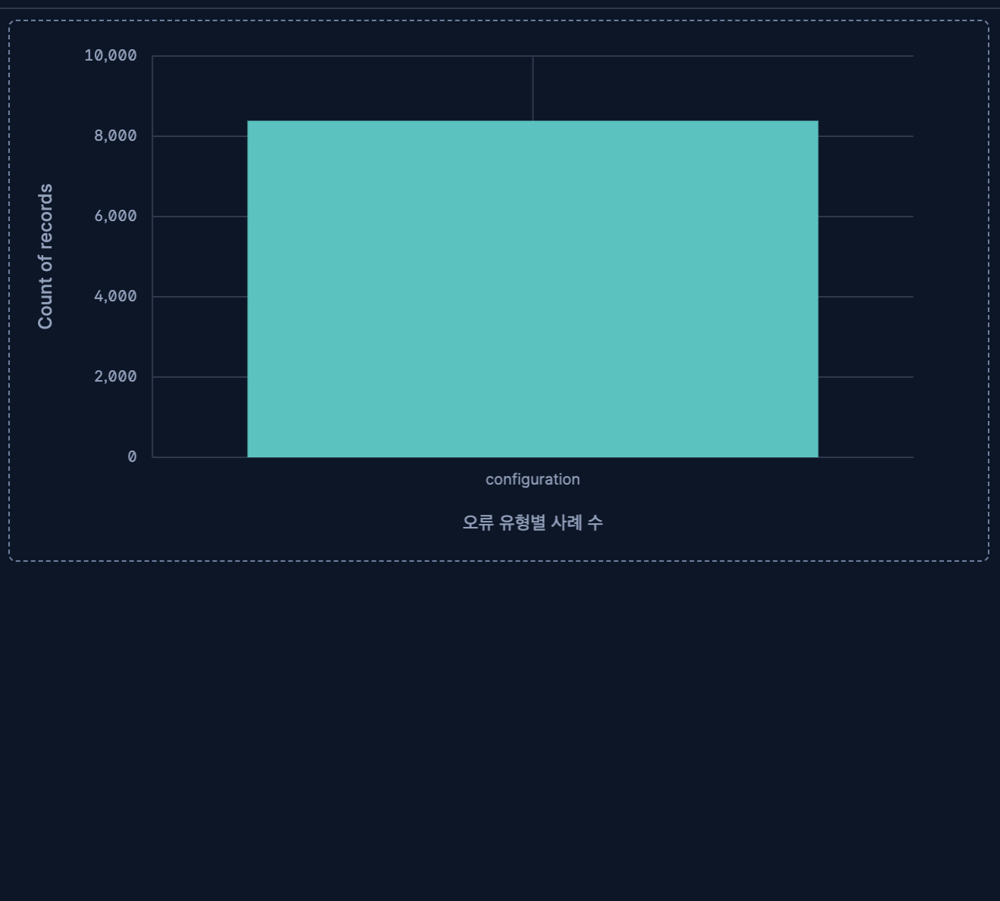

# Day 4 Dashboard 테스트·해석·개선 기록

## 1. 기본 상태

- Dashboard 제목: `Day 4 - DevFix`
- Data View: `DevFix Dashboard` (`devfix-cases`)
- 시간 범위: `2024-12-31 00:00` ~ `2026-08-31 00:00`
- 전체 문서 수: 50,000건
- 패널 수: 7개 + `error_category` Options list 1개

## 2. filter/control 전후 테스트

| 항목 | 적용 전 | 적용 조건 | 적용 후 | Clear 후 | 정상 여부 |
|---|---:|---|---:|---:|---|
| 전체 규모 Metric | 50,000 | `error_category=configuration` | 8,387 | 50,000 | 정상 |
| 기술별 Table의 Docker 사례 수 | 12,535 | `error_category=configuration` | 2,187 | 12,535 | 정상 |
| Docker 평균 해결 시간 | 122.369분 | `error_category=configuration` | 123.627분 | 122.369분 | 정상 |

## 3. 핵심값 교차 검증

| Dashboard 값 | 비교 화면/요청 | 비교값 | 일치 여부 | 다르면 확인한 원인 |
|---|---|---:|---|---|
| 전체 오류 사례 수 50,000 | `GET /devfix-cases/_count` | 50,000 | 일치 | - |
| `configuration` 사례 수 8,387 | `error_category` terms aggregation | 8,387 | 일치 | - |
| 검증 여부 true 37,596 / false 12,404 | `verified` terms aggregation | 37,596 / 12,404 | 일치 | - |

## 4. 결과 해석

1. 전체 50,000건에서 오류 유형 6개가 각각 약 8,300건으로 비슷하게 분포하며, `configuration` Control 적용 후 8,387건으로 줄어들고 관련 패널이 함께 변하는 것을 확인했다.
2. 검증 완료는 37,596건, 미검증은 12,404건이므로 약 75% / 25% 비율이며, 미검증 사례를 따로 점검하는 filter가 유용하다.
3. 해결 시간은 5~240분 범위의 합성 데이터이고 전체 평균은 122.218분이다. 기술·오류 유형별 차이를 실제 난이도 차이로 단정하지 않는다.

## 5. 말할 수 없는 것

- 현재 데이터는 합성 데이터이며 `technology`, `error_category`, `resolution_minutes` 등이 독립적으로 생성되었다. 따라서 특정 기술이 실제로 더 자주 오류가 나거나 해결이 오래 걸린다고 단정할 수 없다.
- `created_at`은 사례 등록 시점이며 실제 오류 발생 시간이 아니므로, Line 차트를 장애 발생 추세로 해석할 수 없다.

## 6. 개선 전·후

- 발견한 문제: Heat map의 긴 `error_category` 라벨이 좁은 패널에서 겹쳐 보인다.
- 개선 전 설정 또는 화면: Heat map을 작은 패널에 배치해 x축 라벨을 읽기 어려웠다.
- 수정한 내용: Heat map 패널의 폭을 늘리고 패널 제목을 `오류 유형별 해결 시간 분포`로 명확히 설정했다.
- 수정한 이유: 오류 유형과 해결 시간 구간을 함께 식별하기 위해서다.
- 개선 후 확인 결과: 셀 색상과 y축 구간은 확인 가능하지만, 긴 영문 x축 라벨은 일부 겹침이 남아 최종 편집에서 추가 확인이 필요하다.

## 7. 최종 제출 체크

- [x] 모든 패널 제목이 질문과 연결된다.
- [ ] 라벨·숫자·축이 겹치거나 잘리지 않는다. Heat map x축 긴 라벨 개선 필요.
- [x] 의도하지 않은 KQL·filter pill이 남아 있지 않다.
- [x] filter/control이 관련 패널에 함께 적용된다.
- [x] 저장 후 다시 열어도 같은 상태가 복구된다.
- [x] 전체 화면 캡처를 저장했다.
- [x] 개인 저장소에 commit했다.
